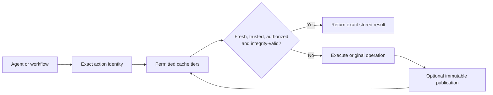

# OnceMesh

**Compute once. Reuse safely.**

Agents repeatedly fetch the same sources, parse the same documents, run the same
tools, and rebuild the same intermediate results. OnceMesh makes that work
reusable without turning correctness, privacy, or trust into an implicit cache
setting.

OnceMesh is an open specification and reference implementation for exact reuse
across agent and workflow runtimes. It identifies a computation from every input
that can affect its output, stores results as content-addressed artifacts, and
applies explicit authorization, freshness, provenance, and integrity policy
before returning previous work.

It can begin as a private cache on one machine, grow into an organization-owned
reuse layer, and—only for deliberately public results—connect to explicitly
trusted federation peers. It is not a semantic prompt cache or an automatic
global data-sharing network.

This repository is specification-first. Normative behavior is defined in
[`spec/action-v0.md`](spec/action-v0.md); the Python package is a small reference
implementation and conformance harness for that document.

The current release candidate is `0.1.0`. It is an alpha-quality protocol and
reference implementation, not a claim of production validation. See the
[`CHANGELOG.md`](CHANGELOG.md), [`SECURITY.md`](SECURITY.md), and
[`docs/release.md`](docs/release.md) before deployment.

New to the project? Read the [practical guide](docs/user-guide.md) for the full
journey from local reuse to private partitions, organization operation, the
Docker federation rehearsal, and contributing a new part of the open mesh.

## Where to go

| You want to… | Start here |
| --- | --- |
| Find a public operator | [OnceMesh Observatory](https://yassinbahri.github.io/OnceMesh/) |
| Try exact reuse locally | [Quick start](#quick-start) |
| Understand privacy and trust boundaries | [User guide](docs/user-guide.md) and [architecture](docs/architecture.md) |
| Run the public federation rehearsal | [Docker federation guide](docs/user-guide.md#run-the-docker-federation-rehearsal) |
| Build or request an adapter | [Adapter catalog](docs/adapters/catalog.md) and [authoring guide](docs/adapters/authoring.md) |
| Register a public mesh | [Public mesh registration](https://github.com/yassinbahri/OnceMesh/issues/new?template=public_mesh_registration.yml) |
| Operate a reference mesh | [`deploy/public-operator/`](deploy/public-operator/) |
| Improve the project | [Contribution guide](CONTRIBUTING.md) |

## How it works



OnceMesh identifies computation by canonicalized inputs, implementation version,
configuration, output schema, and declared variation—not by prompt similarity.
A stored result is returned only after policy, authorization, freshness, receipt,
and artifact checks pass. Otherwise the original operation executes normally.
See the [architecture and trust diagrams](docs/architecture.md).

## Measured results

| Evidence | Result |
| --- | --- |
| Exact PDF/parser reuse | 10/10 eligible parser executions avoided in the controlled run; shadow evidence measured 183.02 s net avoidable parser time |
| Exact substitution overhead | 20/20 hits in 0.49 s total lookup; signed receipts took 0.58 s |
| SQLite/WAL index | 3.756× faster than JSON on Windows and 6.109× on Linux for the same 4,000-commit contention profile |
| Extreme durability stress | 23,200 cross-process JSON-index operations across Windows and non-root Linux |
| Hosted release validation | 195 Python tests, 77% branch coverage, 29 Node checks, 23 integration checks, and 20 Docker checks |

The public workloads did not attach dollar prices, so the repository makes no
claim of measured monetary savings. The [performance and economics guide](docs/performance-and-economics.md)
provides durations, compute reductions, negative results, explicit formulas, and
clearly labeled cost scenarios.

## Readiness

The code-release candidate passes local and hosted release gates and is ready
for a controlled real-workload pilot. It is **not yet proven for unattended
multi-organization production use**: that requires real organization evidence
and independently administered federation. The exact accepted and blocked gates
are recorded in [`docs/readiness.md`](docs/readiness.md); measured evidence is
indexed in [`evaluation/results/README.md`](evaluation/results/README.md).

## v0 scope

Included:

- deterministic action identities;
- content-addressed artifacts;
- result manifests and provenance receipts;
- optional Ed25519-signed production receipts with portable conformance vectors;
- independent Node.js canonicalization and protocol-signature conformance;
- keyed authorization partitions for private tenant and scope isolation;
- bounded HTTP stale-while-revalidate with exact-action single-flight refresh;
- explicit, signed, public-only federation with local trust and transfer limits;
- authenticated bounded federation HTTP with HTTPS-by-default client policy;
- a curated public mesh directory with capabilities and aggregate statistics;
- a framework-neutral private execution-cache bridge with thin runtime adapters;
- freshness and trust checks;
- local and organization-store semantics;
- machine-readable conformance vectors.

Explicitly deferred:

- semantic equivalence;
- automatic trust, decentralized peer discovery, and private or transitive federation;
- reputation, credits, or incentives;
- automatic interception of agent frameworks (explicit adapters are in scope);
- side-effecting actions;
- a claim that signed results are semantically correct.

## Install

OnceMesh requires Python 3.11 or newer. Install the core reference
implementation from PyPI:

```bash
python -m pip install oncemesh
```

Install one framework adapter or the complete adapter set only when needed:

```bash
python -m pip install "oncemesh[langgraph]"
python -m pip install "oncemesh[langchain]"
python -m pip install "oncemesh[llamaindex]"
python -m pip install "oncemesh[adapters]"
```

Version `0.1.0` is a public alpha. Pin the version for controlled pilots and
review the [readiness statement](docs/readiness.md) before operating a shared
or public federation origin.

## Repository map

- `docs/user-guide.md` — practical path through local, private, organization,
  public federation, Docker, adapters, and contribution
- `spec/action-v0.md` — normative protocol specification
- `spec/decisions/` — architectural decision records
- `schemas/` — JSON Schemas for interchange objects
- `conformance/` — portable test vectors
- `src/oncemesh/` — Python reference implementation
- `src/oncemesh/integrations/` — reusable adapter platform and built-ins
- `docs/adapters/` — adapter catalog and contribution guide
- `tests/` — executable conformance and behavior tests
- `evaluation/results/` — machine-readable measurements and analyses
- `.github/` — CI, CodeQL, release, dependency update, and contribution policy
- `directory/` — curated, non-authoritative public mesh catalog and registration policy
- `site/` — static source for the public OnceMesh Observatory

## Development contract

Changes happen in this order:

1. State the behavior and safety invariant in the specification.
2. Add or revise a conformance vector.
3. Update the reference implementation.
4. Run the test suite.

An implementation must not silently define protocol behavior that is absent
from the specification.

## Quick start

For repository development, clone the project and install it in editable mode:

```bash
python -m pip install -e ".[adapters,dev]"
python scripts/verify_repository.py
python -m unittest discover -s tests -v
```

To verify a built wheel and source distribution in an isolated environment:

```bash
python scripts/verify_distribution.py dist
```

```python
from oncemesh import action_digest

action = {
    "spec_version": "oncemesh.action/v0",
    "operation": {"name": "document.parse", "version": "1"},
    "inputs": {"content": {"digest": "sha256:abc", "media_type": "text/html"}},
    "executor": {"name": "example-parser", "version": "2.1.0", "config": {}},
    "output_schema": "oncemesh.example/markdown-v1",
    "vary": {},
}

print(action_digest(action))
```

## M1 shadow evaluation

Shadow mode looks up a candidate but always returns a newly executed result. It
then compares both artifacts and records only verified potential savings:

```python
from datetime import datetime, timedelta, timezone
from oncemesh import FilesystemStore, InMemoryMetrics, run_shadow

store = FilesystemStore(".oncemesh-cache", name="project")
metrics = InMemoryMetrics()
now = datetime.now(timezone.utc)

outcome = run_shadow(
    action,
    [store],
    execute_operation,
    metrics,
    publish_to=store,
    fresh_until=now + timedelta(hours=1),
    now=now,
)

print(metrics.summary())
```

The M1 behavior and promotion criteria are specified in
[`spec/m1-evaluation.md`](spec/m1-evaluation.md).

## Authenticated federation pilot

The experimental HTTP adapter connects explicitly configured public-only peers.
Its request signatures, replay window, response bounds, and deployment limits
are specified in [`spec/federation-http-transport-v0.md`](spec/federation-http-transport-v0.md).
The localhost pilot can be reproduced with:

```bash
python -m unittest discover -s tests -p "test_federation_http.py" -v
```

Plain HTTP is rejected unless the client explicitly enables the loopback-only
test override. Real peer deployments require HTTPS and operational controls
described in the transport specification.

## Discover public meshes

The curated community directory helps users find public federation operators by
operation, region, and status without turning discovery into trust:

**Browse the live directory:** [yassinbahri.github.io/OnceMesh](https://yassinbahri.github.io/OnceMesh/)

```bash
oncemesh-discover list
oncemesh-discover list --operation document.pdf-to-text/1 --region eu-central
oncemesh-discover inspect <peer-id>
```

The initial directory is intentionally empty until a real operator completes
registration. The Pages site adds a scheduled, independently initiated HTTPS
reachability observation and response time. That signal is not a trust decision,
throughput benchmark, or service-level guarantee. Visitors never probe operators
from their browsers, and the CLI never probes an endpoint, changes peer
configuration, imports a key, or authorizes reuse. See the
[directory policy](directory/README.md),
[`public-mesh-directory-v0`](spec/public-mesh-directory-v0.md), and
[`public-mesh-status-v0`](spec/public-mesh-status-v0.md).

To operate a bounded public origin, start with the
[`public operator deployment`](deploy/public-operator/) and its staged
[`acceptance specification`](spec/public-reference-operator-v0.md). The profile
defaults to loopback and serves only reviewed immutable public publications to
explicitly enrolled requester identities; it is not an arbitrary LLM or prompt
execution endpoint.

## Agent-runtime integration

The execution-cache bridge is framework-neutral: exact runtime keys, private
authorization partitions, typed bytes, TTL, trust, clearing, and rollback are
implemented once in the core. Runtime-specific adapters only translate their
native cache interface. Built-in integrations currently cover native Python,
LangGraph, LangChain LLM caching, and LlamaIndex ingestion/KV caching.

Indexed adapters can use the in-memory backend, the transparent JSON filesystem
reference, or the standard-library `SQLiteActiveKeyIndex`. SQLite/WAL is the
recommended local choice under thread or process contention and supports
explicit source-preserving migration from the JSON index.

Install one adapter or the complete development set:

```bash
python -m pip install -e ".[llamaindex]"
python -m pip install -e ".[adapters]"
```

Generic framework cache values remain private to explicitly configured local or
organization stores; they are not public federation artifacts. See
[`spec/execution-cache-bridge-v0.md`](spec/execution-cache-bridge-v0.md).

Custom Python agents and workflows can use the same bridge without LangGraph:

```python
from oncemesh import OnceMeshPythonCache

cache = OnceMeshPythonCache(python_bridge)
outcome = cache.invoke(
    ("research-agent", "extract-facts"),
    exact_input_digest,
    run_extraction,
    ttl=3600,
)
```

The caller supplies the exact key deliberately; the SDK never guesses identity
from `repr`, pickle, or semantic similarity. Codec and adapter requirements are
specified in [`spec/runtime-adapter-sdk-v0.md`](spec/runtime-adapter-sdk-v0.md).
The package map, capability table, extension guide, and reusable test probes are
in [`docs/adapters/README.md`](docs/adapters/README.md).

For a separately administered pilot, use `oncemesh-federation` with the strict
origin and receiver manifests in `schemas/`. Signing seeds are read from named
environment variables and never written to manifests or evidence:

```bash
oncemesh-federation serve --manifest origin-pilot.json
```

```bash
oncemesh-federation probe --manifest receiver-pilot.json
```

The roles, required evidence, acceptance gate, and abort conditions are defined
in [`spec/federation-external-pilot-v0.md`](spec/federation-external-pilot-v0.md).
The complete key generation, publication packaging, preflight, and handoff
sequence is in
[`evaluation/federation-pilot/README.md`](evaluation/federation-pilot/README.md).

## Organization pilot

The `oncemesh-pilot` command validates aggregate daily evidence and computes a
fail-closed promotion report. Synthetic environments are always identified and
can never satisfy the real-environment gate:

```bash
oncemesh-pilot report \
  --config evaluation/organization-pilot/pilot.json \
  --daily evaluation/organization-pilot/daily/*.json \
  --output organization-pilot-report.json
```

The collection contract, privacy boundary, thresholds, and operating procedure
are in [`spec/organization-pilot-v0.md`](spec/organization-pilot-v0.md) and
[`docs/organization-pilot.md`](docs/organization-pilot.md). A real organization
pilot and independently controlled federation remain external evidence gates;
local simulations cannot promote either one.

## Simulated M3 acceptance

With Docker Desktop running, the complete three-role technical rehearsal can be
executed with:

```bash
python evaluation/federation-sandbox/run.py \
  --report .oncemesh-cache/federation-acceptance-local.json
```

It uses isolated origin, receiver, and untrusted-peer containers; an internal
network; scoped Docker secrets; verified test TLS; write-once withdrawal; and a
durable receiver lease. The generated report is always labeled simulated and
cannot be used as evidence of independent organizational control. See
[`spec/federation-simulated-acceptance-v0.md`](spec/federation-simulated-acceptance-v0.md)
and the [step-by-step Docker explanation](docs/user-guide.md#run-the-docker-federation-rehearsal).

## Evaluation runner

The included smoke manifest demonstrates the complete controlled pipeline:

```bash
oncemesh-eval run \
  --manifest evaluation/example-smoke.json \
  --store .oncemesh-cache/evaluation \
  --metrics .oncemesh-cache/events.jsonl \
  --evaluation-id example-smoke-1
```

The runner always performs the real HTTP and conversion work. A passing report
means the configured shadow evidence gate is satisfied; it does not enable
result substitution automatically.

An already-warmed corpus can exercise conditional source validation:

```bash
oncemesh-eval revalidate \
  --manifest evaluation/python-docs-50.json \
  --store .oncemesh-cache/python-docs-50-store \
  --metrics .oncemesh-cache/revalidation-events.jsonl \
  --evaluation-id python-docs-revalidation-1
```

Every 304 response is followed by a full request in shadow mode. Freshness is
extended only when the resulting artifacts match exactly.

Policy-controlled substitution is available only for the reviewed conditional
HTTP profile. It is disabled unless an explicit policy enables it, and can be
stopped immediately with `ONCEMESH_DISABLE_SUBSTITUTION=1`. See
[`spec/operation-policy-v0.md`](spec/operation-policy-v0.md).
