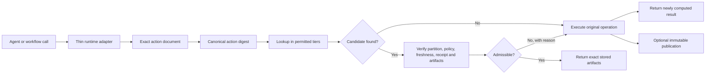
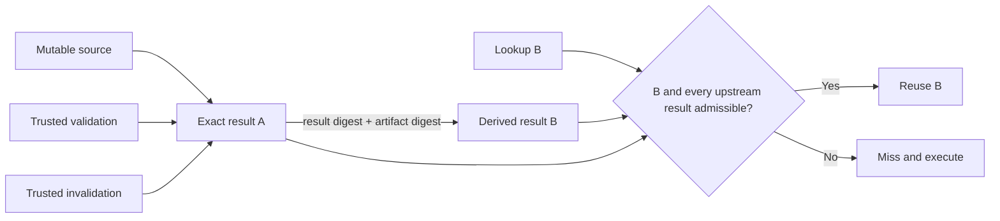
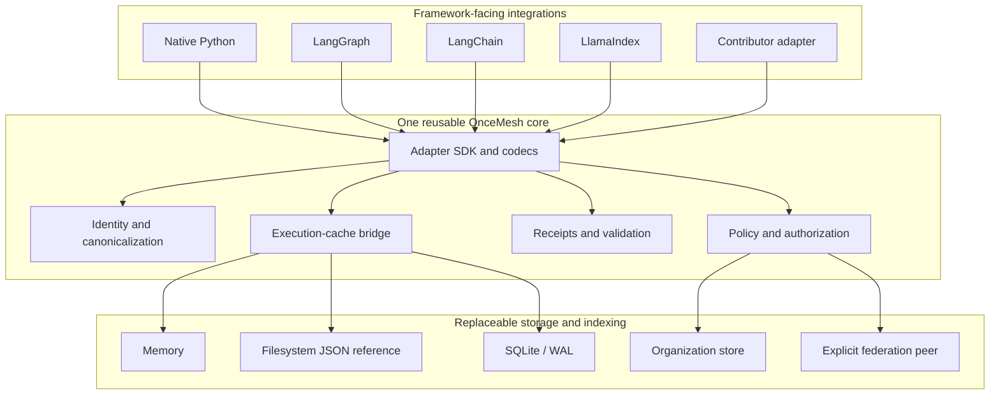
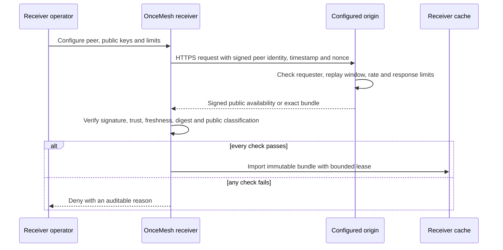
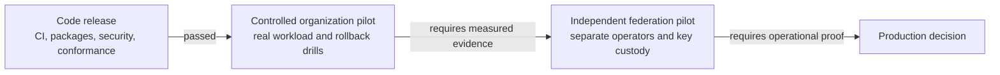

# Architecture and trust model

OnceMesh sits beside an agent or workflow runtime. It does not guess that two
requests are similar. An adapter constructs an exact action document containing
the operation, all output-affecting inputs, executor version and configuration,
output schema, and declared variation dimensions. Canonical JSON gives that
document one content digest.

## Exact reuse path

The important boundary is the admissibility decision. Finding bytes by digest
is insufficient: authorization partition, allowed storage tier, producer trust,
freshness, receipt requirements, key status, and artifact integrity are checked
before substitution. A failed check returns a reason and falls back to ordinary
execution.

## Derived-result admissibility

Result v1 commits to exact upstream result-manifest digests. Lookup recursively
checks those results under the same freshness, producer-trust, invalidation, and
artifact-integrity policy. Traversal is bounded and local. It never deletes an
immutable object and federation v0 never fetches dependencies transitively.

## Shared core and modular adapters

Framework integrations translate native calls and values; they do not re-create
identity, policy, storage, transaction, or trust logic. New adapters implement
the documented SDK contract and can reuse the same conformance probes.

## Federation trust boundary

Federation is explicit, public-only, non-transitive, and fail-closed. A valid
signature authenticates a claim; it does not prove semantic correctness. The
receiver retains its own policy authority.

The public directory is outside this trust path. It helps a user locate and
compare operators, but it never inserts a peer, imports a key, probes an
endpoint, or changes receiver policy.

The GitHub Pages observatory renders the reviewed registry together with a
separate ephemeral status snapshot produced by scheduled Actions. Browser
clients read only the deployed static files and never contact mesh endpoints.
The monitor has no federation credentials and no write path to the registry.

## Evidence and promotion ladder

The first gate is passed for `0.1.0`. Tooling exists for the next two gates, but
local Docker and synthetic organization data cannot satisfy them.

## Further reading

- [`action-v0.md`](../spec/action-v0.md) defines exact action identity.
- [`derived-result-lineage-v0.md`](../spec/derived-result-lineage-v0.md) defines
  cascading admissibility and immutable invalidation.
- [`execution-cache-bridge-v0.md`](../spec/execution-cache-bridge-v0.md) defines
  the framework-neutral bridge.
- [`runtime-adapter-sdk-v0.md`](../spec/runtime-adapter-sdk-v0.md) defines the
  contributor contract.
- [`federation-http-transport-v0.md`](../spec/federation-http-transport-v0.md)
  defines authenticated transport and bounds.
- [`performance-and-economics.md`](performance-and-economics.md) explains the
  measured performance and economic model.
