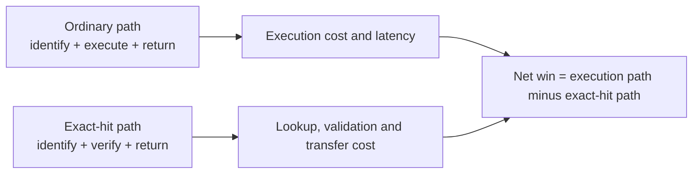

# Performance, compute, and economics

OnceMesh saves work only when the exact action is reusable and every policy and
integrity check passes. This page separates recorded measurements from modeled
economics. Historical results describe the named hardware, software, corpus,
and date; they are not service-level guarantees.

## What was measured

| Experiment | Scale | Recorded duration or result | What it demonstrates |
| --- | ---: | ---: | --- |
| RFC PDF shadow run | 40 operations | 349.60 s execution; 1.23 s lookup | 20/20 candidates matched; 188.93 s net reuse opportunity |
| RFC PDF parser stage | 20 parser executions across two passes | 327.76 s execution | The 10 second-pass matches represented 183.02 s net avoidable parser time |
| RFC PDF exact substitution | 20 exact hits | 0 s operation execution; 0.49 s total lookup | All 20 operations substituted; eligible parser work was not invoked |
| Signed exact substitution | 20 signed hits | 0 s operation execution; 0.58 s total lookup and receipt verification | Signature enforcement added about 91 ms across the run |
| Python documentation shadow run | 200 operations | 40.06 s execution; 4.56 s lookup | 100/100 candidates matched; 13.38 s verified net opportunity |
| Python documentation conditional run | 100 substitutions | 19.63 s lookup plus validation | 11.94 MB body transfer avoided, but the run was 5.14 s slower than full GETs |
| JSON adapter stress, Windows | 11,600 operations | 349.13 s across five phases | Cross-process durability and recovery passed |
| JSON adapter stress, Linux container | 11,600 operations | 38.40 s across five phases | Same correctness profile under non-root Linux |
| SQLite/WAL stress, Windows | 4,000 comparable commits | 27.15 s versus 101.96 s JSON | 3.756× throughput speedup |
| SQLite/WAL stress, Linux | 4,000 comparable commits | 6.23 s versus 38.08 s JSON | 6.109× throughput speedup |

Sources: [`rfc-pdf-10-20260824.json`](../evaluation/results/rfc-pdf-10-20260824.json),
[`rfc-pdf-10-substitution-20260824.json`](../evaluation/results/rfc-pdf-10-substitution-20260824.json),
[`rfc-pdf-10-signed-substitution-20260824.json`](../evaluation/results/rfc-pdf-10-signed-substitution-20260824.json),
[`python-docs-50-20260824.json`](../evaluation/results/python-docs-50-20260824.json),
[`python-docs-50-substitution-20260824.json`](../evaluation/results/python-docs-50-substitution-20260824.json),
[`adapter-stress-20260824.json`](../evaluation/results/adapter-stress-20260824.json),
[`adapter-stress-linux-20260824.json`](../evaluation/results/adapter-stress-linux-20260824.json), and
the [SQLite/WAL analysis](../evaluation/results/sqlite-index-stress-20260825-analysis.md).

The JSON adapter phase totals are sums of the recorded elapsed times. They are
not compared as a Windows-versus-Linux benchmark because the environments were
different. SQLite speedups compare backends within the same environment.

## Computation win



For the RFC corpus, the verified second-pass parser candidates represented
183.58 seconds of parser execution plus lookup. The measured net opportunity was
183.02 seconds after lookup—about 99.7% of that parser-stage time. In the later
controlled run, all eligible parser executions were avoided. This is evidence
for the exact PDF/parser profile only, not for arbitrary LLM calls, OCR, or
nondeterministic tools.

The Python documentation experiment is the counterexample that matters:
conditional validation avoided response bodies but increased latency. OnceMesh
therefore keeps conditional HTTP substitution separately policy-gated instead
of assuming every cache hit is economically useful.

## Release validation duration

The final public-repository run on commit `8b5698c` completed its 11-job CI
matrix in 113 seconds of wall time because jobs ran in parallel. Individual job
elapsed times include runner setup and dependency installation.

| Hosted job | Elapsed |
| --- | ---: |
| Ubuntu core, Python 3.11 / 3.12 / 3.13 | 24 s / 19 s / 22 s |
| Windows core, Python 3.11 / 3.12 / 3.13 | 39 s / 48 s / 48 s |
| Real adapters, Ubuntu / Windows | 42 s / 108 s |
| Distribution verification | 22 s |
| Quality and dependency security | 64 s |
| Docker federation acceptance | 65 s |
| CodeQL Python analysis | 59 s |

The same commit passed 183 Python tests at 77% branch-aware coverage, 29 Node
conformance checks, 23 framework/runtime integration checks, and 20 Docker
federation checks. See the
[`hosted-release-validation` report](../evaluation/results/hosted-release-validation-0.1.0-20260825.json).

## Cost model

No dollar saving was measured in the committed public-corpus experiments: their
configured estimated operation cost was zero. In this evidence profile, zero
means “not priced,” not “free.” Production savings must use organization-owned
prices or invoices.

For `N` requests, eligible fraction `e`, exact-hit rate `h`, ordinary execution
cost `Ce`, reuse-path cost `Cr`, and fixed operating cost `F`:

```text
exact hits       = N × e × h
baseline cost    = N × Ce
net cost saved   = exact hits × (Ce - Cr) - F
projected cost   = baseline cost - net cost saved
net time saved   = exact hits × (Te - Tr)
```

`Cr` should include lookup, validation, storage, transfer, and any per-hit
service charge. `F` should include infrastructure, monitoring, backups, and
operations. The normative claim rules are in
[`economic-evidence-v0.md`](../spec/economic-evidence-v0.md).

## Illustrative scenarios—not measured OnceMesh savings

| Scenario assumptions per month | Exact hits | Net cost saved | Overall cost reduction | Net execution time saved |
| --- | ---: | ---: | ---: | ---: |
| 100k calls; 50% eligible; 60% hit; $0.005 execute; $0.0001 reuse; $50 fixed; 2.0 s vs 0.03 s | 30,000 | $97 | 19.4% | 16.4 h |
| 1M calls; 70% eligible; 40% hit; $0.02 execute; $0.0002 reuse; $500 fixed; 8.0 s vs 0.05 s | 280,000 | $5,044 | 25.2% | 618.3 h |
| 200k document jobs; 60% eligible; 50% hit; $0.08 execute; $0.0005 reuse; $300 fixed; 25 s vs 0.05 s | 60,000 | $4,470 | 27.9% | 415.8 h |

These examples show sensitivity, not expected returns. If exact eligibility or
hit rate is low, if reuse validation is expensive, or if fixed operating cost
is high, net savings can be negative. For LLM workflows, token cost can be used
only when the action identity covers the complete output-affecting request and
the operation is explicitly approved for exact reuse.

## How to produce a defensible business case

1. Run shadow mode on the real operation and workload window.
2. Require zero unexplained mismatches and record exact candidate eligibility.
3. Measure execution, lookup, validation, bytes, and error rates.
4. Attach organization-owned unit prices; do not substitute public list prices
   for actual contracted cost without labeling the assumption.
5. Include storage, transfer, observability, backup, and operator cost.
6. Exercise the kill switch and compare projected savings with invoiced results
   during a controlled pilot.
