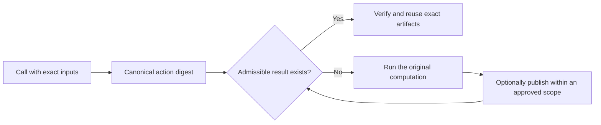
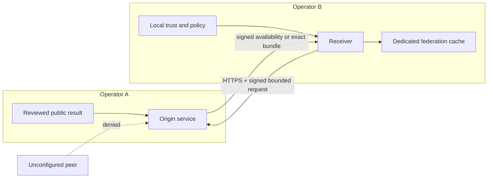
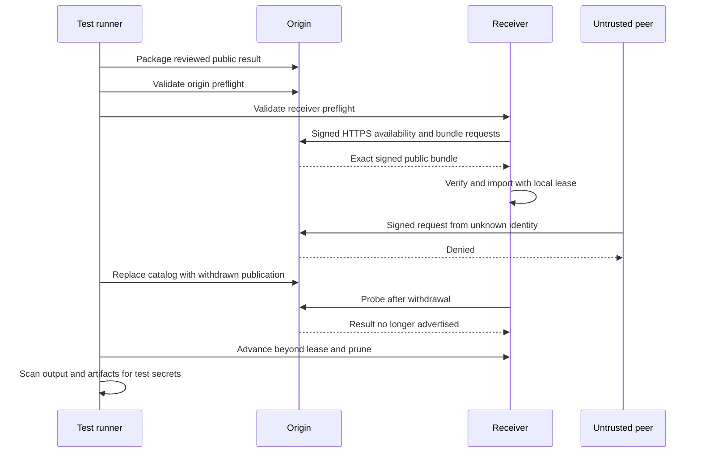

# A practical guide to OnceMesh

Agents and workflows often repeat deterministic work: fetching the same source,
parsing the same document, rendering the same representation, running the same
tool with the same version, or asking a deterministic model endpoint for an
exactly identical result. Ordinary caches can make that faster, but they often
hide the hard questions:

- What exactly makes two computations the same?
- Who is allowed to reuse the result?
- Is the result still fresh and intact?
- Who produced it, and which key signed that claim?
- Can another framework or organization understand it?
- Can reuse be stopped without redeploying the application?

OnceMesh makes those questions explicit. It is an open protocol, a Python
reference implementation, and a set of conformance and evaluation tools for
reusing exact computation safely.

The project is not a semantic prompt cache and it does not create a global pool
of private agent data. “Open mesh” means an open, implementable protocol and an
ecosystem of adapters and storage backends. Every organization still chooses
its peers, policies, keys, data classifications, and retention.

## The idea in one minute



An action digest covers the operation name and version, exact inputs, executor
and configuration, output schema, and declared variation. A candidate is useful
only if its storage tier, authorization partition, freshness, producer, receipt,
signing-key status, and artifact digests satisfy local policy.

This makes a hit explainable and a miss safe. Failure falls back to normal
execution; it does not widen access or silently accept approximate output.

## Choose the right scope

OnceMesh separates identity from distribution. The same exact-action rules can
be used at several scopes, but publishing to a wider scope is always an explicit
decision.

| Scope | Intended use | Who can see it | Important rule |
| --- | --- | --- | --- |
| Run or memory | One process, test, or short-lived worker | The current process | Disappears with the process and provides no cross-process durability |
| Local/project | Reuse on one machine or project workspace | Users and processes allowed by local filesystem policy | Publication defaults here; use SQLite/WAL when processes contend |
| Private partition | Tenant-, principal-, or authorization-scoped reuse | Only callers whose application authorization and opaque partition match | Raw claims never enter action documents, metrics, or public evidence |
| Organization | Shared reuse inside one administrative boundary | Services explicitly authorized by the organization | The organization owns storage, policy, retention, keys, monitoring, and rollback |
| Public federation | Opt-in exchange between configured organizations | Explicitly configured peers for an affirmatively public result | Only `public` classification is accepted; private federation is not implemented |

### Local and project reuse

Start here. Use memory for tests, the JSON filesystem backend when transparency
matters more than throughput, or SQLite/WAL for a contended local deployment.
No peer or public service is required.

The framework-neutral bridge lets a custom workflow provide its exact key
directly:

```python
from oncemesh import OnceMeshPythonCache

cache = OnceMeshPythonCache(python_bridge)
outcome = cache.invoke(
    ("research-agent", "extract-facts-v1"),
    exact_input_digest,
    run_extraction,
    ttl=3600,
)
```

The key must change when any output-affecting input, tool, model, configuration,
or implementation changes. OnceMesh deliberately refuses to derive identity
from `repr`, pickle, or semantic similarity.

### Private and multi-tenant reuse

A private authorization partition is a keyed, non-reversible token derived from
the application's authorization claims. It prevents a candidate created for one
tenant, principal, or scope from becoming a hit for another.

The partition is an isolation input, not an authorization system. Applications
must authorize access before calling OnceMesh, and stores must enforce their own
access controls. Possessing or guessing a partition token never grants permission
to read an artifact.

Partition-key rotation changes the resulting action identities, causing safe
misses instead of cross-partition reuse. Generic LangGraph, LangChain,
LlamaIndex, and Python cache values remain in configured local or organization
stores and are never exported through public federation.

### Organization reuse

An organization store is shared infrastructure within one accountable security
boundary. A useful deployment needs more than a shared directory:

- named workload, security, and operations owners;
- protected receipt and partition keys;
- managed TLS and least-privilege service access;
- retention, backup, monitoring, incident, and rollback procedures;
- a shadow measurement window before substitution; and
- a tested `ONCEMESH_DISABLE_SUBSTITUTION=1` kill switch.

Use [`organization-pilot.md`](organization-pilot.md) to collect aggregate,
content-free daily evidence. Synthetic records can test the reporter, but only a
real workload with accountable owners can pass the real-environment gate.

### Public federation

Federation is narrow by design. The curated directory can help a user find an
operator, but there is no automatic trust, decentralized discovery, or
transitive trust. A receiver explicitly configures an origin endpoint, request
identity, availability key, trusted receipt keys, allowed producers and
operations, size bounds, timeouts, and a local retention lease.

The origin must deliberately package an immutable result with classification
`public`. Missing, unknown, private, internal, or confidential classifications
are rejected before catalog insertion. Withdrawal stops future advertisement,
but it cannot promise deletion of bytes already transferred to another operator;
the receiver's bounded lease handles local expiry.



Request signatures prevent anonymous access and replay; TLS protects transport;
receipts authenticate result claims; content digests protect artifacts; and the
receiver's policy decides whether the claim is acceptable. None of these proves
that an output is semantically correct.

### Discover a public mesh

Browse the human directory at
[yassinbahri.github.io/OnceMesh](https://yassinbahri.github.io/OnceMesh/), or use
the machine-friendly CLI:

```bash
oncemesh-discover list
oncemesh-discover list --operation document.pdf-to-text/1 --region eu-central
oncemesh-discover inspect <peer-id>
```

The command reads the canonical curated snapshot from this repository. Search
shows capabilities, region, status, public key fingerprints, and optional
aggregate statistics. `observed` means a directory-controlled health check
reached the endpoint during the stated window; it does not certify the operator
or its results.

Discovery stops at inspection. To use a mesh, independently verify the operator
and key fingerprints, decide which producers and operations to trust, then add a
peer to the receiver's local configuration. See the
[`directory policy`](../directory/README.md). The directory begins empty rather
than presenting the one-host Docker simulation as a public operator.

The web directory also shows the most recent hosted reachability observation and
response time. It does not run checks in a visitor's browser. A scheduled GitHub
Actions monitor sends one unauthenticated bounded request, so the signal cannot
prove that an authorized exchange or advertised operation will succeed. See
[`public-mesh-status-v0`](../spec/public-mesh-status-v0.md).

## Run the Docker federation rehearsal

The Docker rehearsal is the fastest way to see the complete federation protocol
without operating two real organizations.

### Prerequisites

- Python 3.11 or newer;
- Docker Desktop or Docker Engine with the Compose plugin running; and
- a fresh clone of this repository.

Install the project and run the rehearsal with a new report filename:

```bash
python -m pip install -e ".[dev]"
python evaluation/federation-sandbox/run.py \
  --report .oncemesh-cache/federation-acceptance-local.json
```

Reports are write-once. Choose a different name for a later run or deliberately
remove the old ignored report first.

### What the rehearsal creates

The runner creates an ephemeral workspace, test certificate authority, TLS
certificate, and separate signing seeds. Docker Compose then starts three roles
on an internal network:

1. **Origin** owns one explicitly reviewed public publication and the
   availability signing key.
2. **Receiver** owns a different request key and a durable, lease-bounded
   federation cache.
3. **Untrusted peer** has its own key but is absent from the origin allowlist.

The role containers run as non-root users, use read-only root filesystems, drop
Linux capabilities, receive only their scoped Docker secrets, and expose no
origin port to the host.

### What happens during the run



The final report contains 20 checks covering identity separation, TLS,
request authentication, replay and trust boundaries, public-only publication,
artifact integrity, untrusted-peer denial, withdrawal, lease expiry, container
isolation, and secret cleanup.

### What a passing report proves

It proves that the reference implementation can execute the technical protocol
across isolated roles on the tested host. It does **not** prove independent
administration: one person and one machine still control every container, key,
network, and artifact. The report is permanently labeled simulated and cannot
satisfy the external federation gate.

For an actual two-operator pilot, each organization keeps its own seed and
completed manifest and follows the
[`external federation runbook`](../evaluation/federation-pilot/README.md).

## Connect a framework or your own runtime

Built-in integrations cover native Python, LangGraph, LangChain LLM caching,
and LlamaIndex KV/ingestion caching. Install only the extra you need:

```bash
python -m pip install -e ".[langgraph]"
python -m pip install -e ".[langchain]"
python -m pip install -e ".[llamaindex]"
```

Adapters stay thin. They translate a framework's key, value, TTL, batch, and
clear operations into the shared bridge. Identity, codecs, authorization,
freshness, storage transactions, and failure behavior remain in one core.

To support another framework:

1. Read the [adapter authoring guide](adapters/authoring.md).
2. Add a dependency-free descriptor to the adapter registry.
3. Implement one integration module using the shared bridge and codecs.
4. Add an optional dependency extra instead of forcing the framework on every
   user.
5. Run the shared conformance probes and a real framework workflow test.
6. Document supported capabilities and deliberate limitations in the catalog.

The runnable [`custom_runtime_adapter.py`](../examples/custom_runtime_adapter.py)
example is the smallest useful starting point.

## Help build the open mesh

There are several meaningful contribution paths; adding another framework is
only one of them.

### Protocol and conformance

Propose an observable behavior, its safety invariant, accepted and rejected
examples, compatibility impact, and portable vectors. Independent
implementations in Go, Rust, JavaScript, or another language are especially
valuable because they reveal accidental Python-specific behavior.

### Adapters and codecs

Add a framework integration, a safe deterministic codec, or compatibility tests
for a new upstream version. Shared behavior belongs in the core; framework
modules should remain translators.

### Storage and indexing

Implement the existing store or `ActiveKeyIndex` contracts for PostgreSQL,
Redis, object storage, or another backend. Preserve atomic publication,
generation checks, rollback, integrity, and clear semantics rather than changing
the adapter API.

### Measurements and real-world evidence

Run shadow evaluations on deterministic, legally retrievable workloads. Commit
only content-free aggregate evidence with environment, versions, duration,
negative results, and limitations. Never publish customer data, URLs, tenant
identifiers, credentials, private keys, or raw payloads.

### Operations and federation

Improve deployment examples, observability, secret-manager integrations,
retention tools, and operator runbooks. A genuine independently administered
two-organization pilot is a major project milestone.

Public mesh operators can also submit a directory registration. Profiles must
remain public-only, expose public keys rather than secrets, and label statistics
as operator-reported until directory-controlled probes exist.

### Documentation and review

Clarify a confusing concept, reproduce an evaluation, review threat boundaries,
or add a minimal example. Small, precise contributions are welcome.

All behavioral changes follow the same path:

```text
proposal -> specification -> conformance vector -> implementation -> tests -> evidence
```

Start with [`CONTRIBUTING.md`](../CONTRIBUTING.md), check the
[adapter catalog](adapters/catalog.md), and open an issue using the relevant
template. Security vulnerabilities should follow [`SECURITY.md`](../SECURITY.md)
rather than a public issue.

## Where to go next

- [Architecture and trust model](architecture.md)
- [Performance, compute, and economics](performance-and-economics.md)
- [Adapter platform](adapters/README.md)
- [Readiness boundaries](readiness.md)
- [Specifications and decisions](../spec/README.md)
- [Measured evidence](../evaluation/results/README.md)
